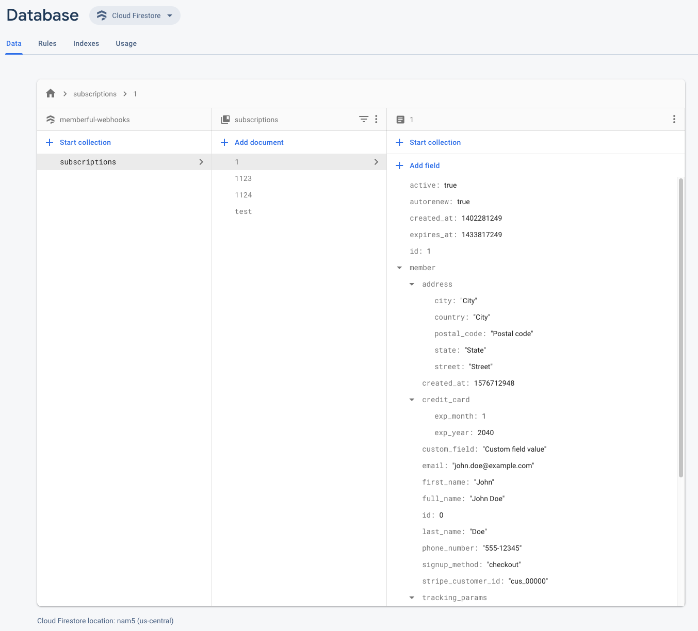

# Memberful Firebase webhooks example

This repo is a basic example of extracting data from a Memberful webhook and storing it in Google Firebase.

To deploy you need Cloud Functions for Firebase enabled on your project and a Firestore collection named "subscriptions".

Any Memberful webhooks containing a subscription object, like "subscription.updated", will create or update the subscription by ID when posted to the function endpoint.

All the logic can be found in functions/index.js.

